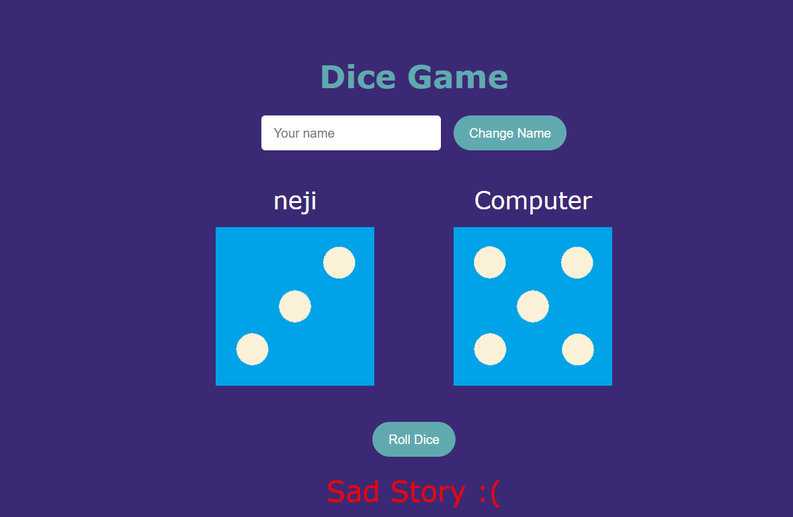

# Dice Game - React

 -Enjoy!

**Web app url**: https://nejidicegambling.netlify.app/

## How to Run the Project

1. Colone the repository:
```
https: https://github.com/onuryilmaze/dicegame.git
```
2. Navigate to the project folder
```
cd dicegame
```
3. Install dependencies
```
npm install
```
4. Run the project
```
npm run dev
```
5. Open your browser and navigate to localhost


### ScreenShot



